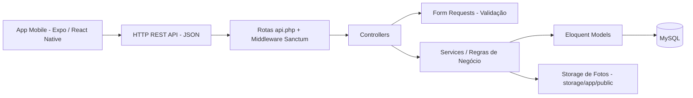
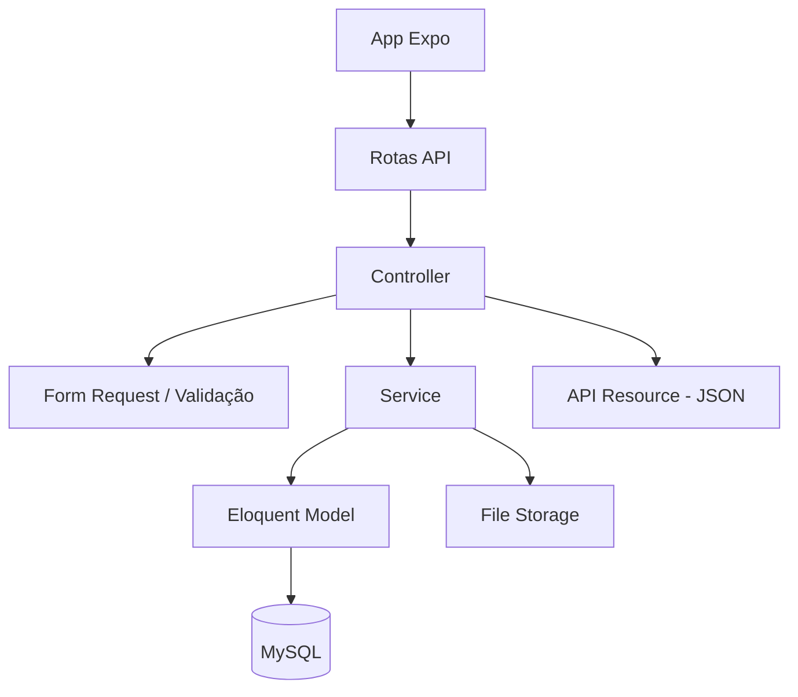
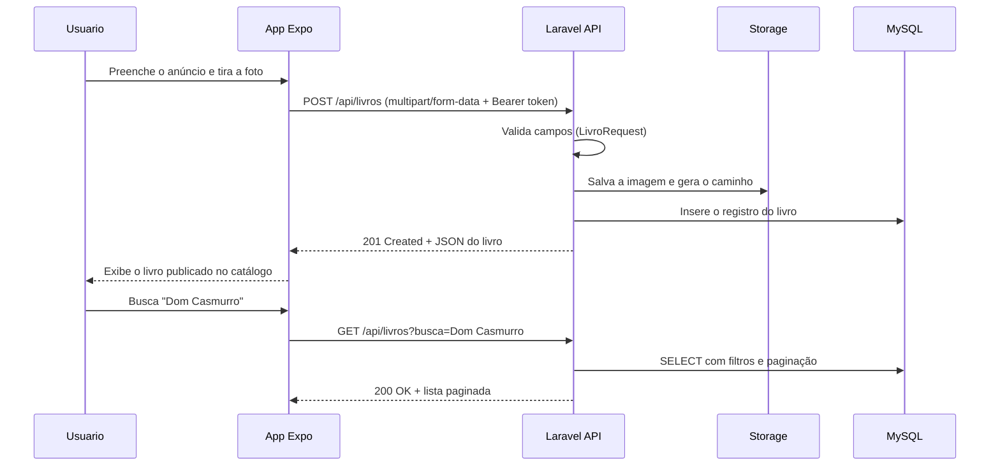

# 📚 Traça — Sebo Online

[](#-testes)

## 📖 Dando uma segunda vida aos livros

### Compre, venda e encontre livros usados direto do celular — com foto, descrição, preço e estado de conservação de cada exemplar.

[](#️-stack-tecnológica)
[](#️-stack-tecnológica)
[](#️-stack-tecnológica)
[](#️-stack-tecnológica)
[](#️-stack-tecnológica)
[](#-segurança)

---

# 🛠️ Início rápido (desenvolvimento)

Pré-requisitos:

- PHP 8.2+
- Composer 2+
- MySQL 8+ (ou PostgreSQL 14+)
- Node.js 20+
- Expo Go instalado no celular (ou emulador Android/iOS)

**Backend** (Laravel API REST):

```bash
cd backend
composer install
cp .env.example .env
php artisan key:generate
php artisan storage:link
php artisan migrate --seed
php artisan serve --host=0.0.0.0 --port=8000
```

Por padrão, a API sobe em `http://localhost:8000/api`.

**Configuração de Ambiente (.env)**:

- **Backend**: preencha `DB_DATABASE`, `DB_USERNAME`, `DB_PASSWORD`, `APP_URL` e `FILESYSTEM_DISK=public`.
- **Mobile**: crie `.env` e aponte `EXPO_PUBLIC_API_URL` para o IP da máquina que roda o Laravel (ex.: `http://192.168.0.10:8000/api` — `localhost` não funciona no celular físico).

**Mobile** (Expo + React Native):

```bash
cd mobile
npm install
npx expo start
```

**Testes**:

```bash
cd backend && php artisan test
```

---

# 📌 Sobre o Projeto

**Traça** é um sebo online: um marketplace de livros usados onde qualquer usuário pode anunciar exemplares da própria estante e comprar os de outras pessoas.

> 🎯 **Estado atual**: Entrega 1 em desenvolvimento — API REST em Laravel com o CRUD completo de livros (mínimo de 7 atributos, incluindo números, textos, datas e foto).

## 🎯 Problema Resolvido

### Antes:

- Livros parados na estante sem destino
- Anúncios espalhados em grupos de WhatsApp e marketplaces genéricos
- Sem padrão para descrever estado de conservação
- Fotos e preços perdidos no meio da conversa
- Difícil achar um título específico usado

### Depois:

- Catálogo único e pesquisável de livros usados
- Ficha padronizada: foto, estado, preço, ano e descrição
- Anúncio publicado direto do celular, com foto da câmera ou galeria
- Histórico de anúncios e compras por usuário
- Busca e filtro por título, autor, gênero e faixa de preço

---

# 🌟 Principais Funcionalidades

## 🛒 Comprador

- Navegar pelo catálogo de livros disponíveis
- Buscar por título, autor ou gênero e filtrar por preço/estado
- Ver a ficha completa do livro (foto, descrição, estado, ano, vendedor)
- Favoritar livros e montar carrinho
- Acompanhar o histórico de pedidos

## 📕 Vendedor

- Cadastrar livro com foto tirada na hora ou vinda da galeria
- Definir preço, estado de conservação e quantidade em estoque
- Editar e remover os próprios anúncios
- Marcar livro como vendido ou indisponível
- Ver a lista dos seus anúncios ativos

## 🛠️ Administrador

- Gerenciar gêneros/categorias do catálogo
- Moderar anúncios e usuários
- Visualizar métricas básicas (livros cadastrados, vendas, usuários ativos)

---

# 🧠 Arquitetura do Sistema



---

# 🏗️ Arquitetura em Camadas



---

# 📂 Estrutura de Pastas

```
traca/
│
├── backend/
│   ├── app/
│   │   ├── Http/
│   │   │   ├── Controllers/Api/
│   │   │   ├── Requests/
│   │   │   ├── Resources/
│   │   │   └── Middleware/
│   │   ├── Models/
│   │   └── Services/
│   ├── database/
│   │   ├── migrations/
│   │   ├── factories/
│   │   └── seeders/
│   ├── routes/
│   │   └── api.php
│   └── tests/
│       └── Feature/
│
├── mobile/
│   ├── app/            (rotas — expo-router)
│   ├── components/
│   ├── services/       (cliente axios)
│   ├── hooks/
│   ├── contexts/
│   └── assets/
│
└── docs/
    ├── tema-e-equipe.md
    ├── cronograma.md
    └── contrato-api.md
```

---

# ⚙️ Stack Tecnológica

## 🛠️ Backend

- PHP 8.2+
- Laravel 11
- Eloquent ORM
- Laravel Sanctum (autenticação por token)
- Form Requests (validação)
- API Resources (padronização do JSON)
- Intervention Image (redimensionamento de fotos)
- PHPUnit / Pest

## 📱 Mobile

- React Native via Expo (SDK 51+)
- TypeScript
- expo-router (navegação)
- Axios (consumo da API)
- expo-image-picker (câmera e galeria)
- AsyncStorage (token de sessão)
- React Hook Form

## 🗄️ Banco de Dados

- MySQL 8 (PostgreSQL também suportado)
- Migrations e Seeders via Artisan
- Factories para massa de teste

## 🖼️ Arquivos

- Storage local do Laravel (`storage/app/public` + `php artisan storage:link`)
- Preparado para migrar para S3/Cloudinary sem alterar os controllers

---

# 🔁 Fluxo Principal do Sistema



---

# 📋 Regras de Negócio

## 🔒 Regras Obrigatórias

- **RN1** — Todo livro pertence a um usuário vendedor; só o dono (ou o admin) pode editar ou excluir o anúncio
- **RN2** — Preço deve ser maior que zero e é gravado com 2 casas decimais
- **RN3** — Foto é obrigatória no cadastro; formatos aceitos: JPG/PNG, até 5 MB
- **RN4** — Ano de publicação não pode ser maior que o ano atual
- **RN5** — Estado de conservação é restrito a: Novo, Ótimo, Bom, Regular, Desgastado
- **RN6** — Livro com estoque zerado não aparece no catálogo público
- **RN7** — ISBN, quando informado, deve ser único no sistema
- **RN8** — Exclusão de livro é lógica (soft delete), preservando o histórico de pedidos
- **RN9** — Rotas de escrita exigem token válido; o catálogo é de leitura pública

---

# 🗃️ Modelagem de Dados

## Tabela: `usuarios`

| Campo       | Tipo      |
| ----------- | --------- |
| id          | BIGINT    |
| nome        | VARCHAR   |
| email       | VARCHAR (único) |
| senha       | VARCHAR (hash) |
| telefone    | VARCHAR   |
| cidade      | VARCHAR   |
| tipo        | VARCHAR (usuario/admin) |
| created_at  | TIMESTAMP |

## Tabela: `livros` — **entidade principal do CRUD**

| Campo               | Tipo      | Categoria exigida |
| ------------------- | --------- | ----------------- |
| id                  | BIGINT    | número            |
| usuario_id          | BIGINT    | número (FK)       |
| genero_id           | BIGINT    | número (FK)       |
| titulo              | VARCHAR   | string            |
| autor               | VARCHAR   | string            |
| editora             | VARCHAR   | string            |
| isbn                | VARCHAR   | string            |
| descricao           | TEXT      | string            |
| estado_conservacao  | VARCHAR   | string            |
| preco               | DECIMAL(10,2) | número        |
| estoque             | INTEGER   | número            |
| ano_publicacao      | INTEGER   | número            |
| data_publicacao     | DATE      | **data**          |
| data_aquisicao      | DATE      | **data**          |
| foto                | VARCHAR (caminho do arquivo) | **foto** |
| created_at          | TIMESTAMP | data              |
| updated_at          | TIMESTAMP | data              |

> ✅ São 15 atributos no total, cobrindo os 4 tipos exigidos na entrega: **números**, **strings**, **datas** e **foto**.

## Tabela: `generos`

| Campo | Tipo    |
| ----- | ------- |
| id    | BIGINT  |
| nome  | VARCHAR |
| slug  | VARCHAR |

## Tabela: `pedidos`

| Campo        | Tipo      |
| ------------ | --------- |
| id           | BIGINT    |
| comprador_id | BIGINT    |
| livro_id     | BIGINT    |
| quantidade   | INTEGER   |
| valor_total  | DECIMAL   |
| status       | VARCHAR (pendente/pago/enviado/concluido) |
| created_at   | TIMESTAMP |

## Tabela: `favoritos`

| Campo      | Tipo   |
| ---------- | ------ |
| usuario_id | BIGINT |
| livro_id   | BIGINT |

---

# 🌐 Endpoints da API

## Autenticação

```
POST   /api/auth/register
POST   /api/auth/login
POST   /api/auth/logout      (autenticado)
GET    /api/auth/me          (autenticado)
```

## Livros (CRUD principal)

```
GET    /api/livros              (lista pública, com busca, filtro e paginação)
GET    /api/livros/{id}         (detalhe)
POST   /api/livros              (cadastro com upload de foto — autenticado)
PUT    /api/livros/{id}         (edição — dono do anúncio)
DELETE /api/livros/{id}         (remoção lógica — dono do anúncio)
GET    /api/meus-livros         (anúncios do usuário logado)
```

Parâmetros de listagem: `?busca=`, `?genero_id=`, `?preco_min=`, `?preco_max=`, `?estado=`, `?page=`

## Gêneros, Pedidos e Favoritos

```
GET    /api/generos
POST   /api/generos             (admin)

GET    /api/pedidos
POST   /api/pedidos
GET    /api/pedidos/{id}

GET    /api/favoritos
POST   /api/favoritos/{livroId}
DELETE /api/favoritos/{livroId}
```

---

# 🔐 Segurança

## Implementado / Planejado:

- Autenticação por token com Laravel Sanctum
- Hash de senha com Bcrypt (padrão do Laravel)
- Validação de entrada em todas as rotas via Form Requests
- Policies para garantir que só o dono edita o próprio anúncio
- Proteção contra SQL Injection pelo Eloquent/Query Builder
- Validação de tipo e tamanho no upload de imagens
- CORS configurado apenas para as origens do app
- Conformidade com a LGPD no tratamento de dados pessoais

---

# 🧪 Testes

```bash
cd backend && php artisan test
```

Cobertura planejada:

- Feature tests dos 5 endpoints do CRUD de livros
- Testes de validação (campos obrigatórios, preço inválido, ano futuro)
- Teste de autorização (usuário não-dono não edita)
- Teste de upload de foto

---

# 📄 Documentação e Planejamento

- `docs/tema-e-equipe.md` — Tema do trabalho e integrantes
- `docs/cronograma.md` — Cronograma completo por semana
- `docs/contrato-api.md` — Contrato de request/response de cada rota

---

# 📈 Roadmap

## ✏️ Fundação do Projeto

- [x] Definição do tema e da equipe
- [x] Escolha da stack
- [ ] Modelagem de dados
- [ ] Contrato da API

## 🔨 Entrega 1: API REST Laravel

- [ ] Projeto Laravel + conexão com o banco
- [ ] Migrations, models e relacionamentos
- [ ] CRUD completo de livros (7+ atributos)
- [ ] Upload e retorno da foto
- [ ] Validação via Form Requests
- [ ] Autenticação com Sanctum
- [ ] Seeders com dados de exemplo
- [ ] Testes de feature do CRUD

## 📱 Entrega 2: App Mobile Expo

- [ ] Projeto Expo + navegação
- [ ] Telas de login e cadastro
- [ ] Catálogo com busca e filtros
- [ ] Tela de detalhe do livro
- [ ] Formulário de anúncio com câmera/galeria
- [ ] Tela "Meus anúncios"

## 🚀 Entrega 3: Integração e Melhorias

- [ ] Carrinho e pedidos
- [ ] Favoritos
- [ ] Perfil do usuário
- [ ] Deploy da API
- [ ] Apresentação final

---

# 🎨 Diferenciais

## 💥 O que torna o Traça especial:

### Ficha padronizada

Estado de conservação, ano e descrição em campos fixos — nada de "tá bem conservadinho" no meio do texto

### Foto tirada na hora

O anúncio nasce da câmera do celular, sem precisar passar arquivo pro computador

### API independente

O backend Laravel serve o app Expo hoje e qualquer outro cliente (web, desktop) depois

### Feito pra celular

Fluxo pensado para quem anuncia e compra na palma da mão

---

# 🤝 Contribuição

## Padrões:

- Separação em camadas (Controller / Request / Service / Model)
- Branches por feature (`feature/crud-livros`), PR para `dev`, `main` protegida
- Commits organizados por feature (padrão Conventional Commits)
- Pull Requests com pelo menos 1 revisão antes do merge

---

# 📜 Licença

Projeto acadêmico da disciplina de Dispositivos Móveis, livre para fins educacionais.

---

# 📚 Traça

### Todo livro merece um próximo leitor.

## "Sua estante tem histórias esperando alguém."
